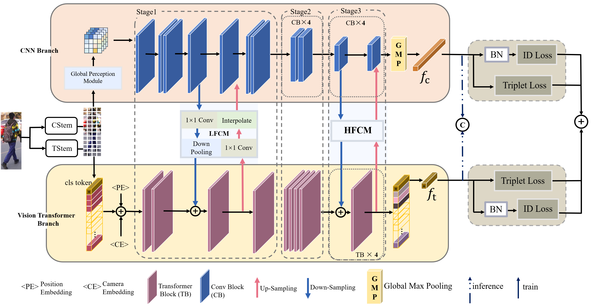

# Heterogeneous Feature-aware Transformer-CNN Coupling Network for Person Re-identification

(https://github.com/naziaperwaiz/Heterogeneous Feature-aware Transformer-CNN Coupling Network for ReID/blob/main/Figures/architecture.jpg)
This repository holds the codes and models for the paper

Person re-identification (re-id) identifies a query person in multiple non overlapping camera views where the same person appears in different poses, angles and views under different illumination conditions. 

# Datasets

If training script does not download the dataset, kindly download respective dataset from given links and place in the "/data/" folder before starting the training.
## Market1501
Market 1501 dataset can be downloaded from [Openlink](http://zheng-lab.cecs.anu.edu.au/Project/project_reid.html)
## DukeMTMC-reID
DukeMTMC-reID dataset is an open-access dataset, the dataset can be downloaded via GoogleDriver and BaiduYun, the [download links](https://github.com/sxzrt/DukeMTMC-reID_evaluation#download-dataset) are shared by the authors of DukeMTMC-ReID dataset via their [github repository](https://github.com/sxzrt/DukeMTMC-reID_evaluation). The authors of the dataset are very generous to handle the queries regarding dataset download links as mentioned [here](https://github.com/sxzrt/DukeMTMC-reID_evaluation#download-dataset).

## MSMT17
MSMT17 dataset can be downloaded by following the detailed instructions available [here](https://www.pkuvmc.com/dataset.html)

# Training

The configuration file (config.py) sets person re-id dataset Market1501 as the default dataset. To choose any other person re-id dataset, Ln 18-19 needs to be changed in the config file for respective dataset. The code will automatically download and use the respective dataset when the training script is run.

Training: Start the training by using command: python train.py

# Proposed results
The proposed network is trained and evaluated on three different preson re-id datasets, graphical representation of the results is given below:

改

The evaluation is automatically done after training of the model, however for early evaluation, evaluation frequency (Ln 103 of config file) should be changed (can be set as 10, 20 etc). For only evaluation using trained model weights, change the Ln 102 of config file by setting test.evaluate=True. Trained weights of the proposed model for Market1501 dataset are available at https://drive.google.com/drive/folders/1PxmG0Na_wwe1F_97QlNi9Eyc-RAJP5-T?usp=sharing.

